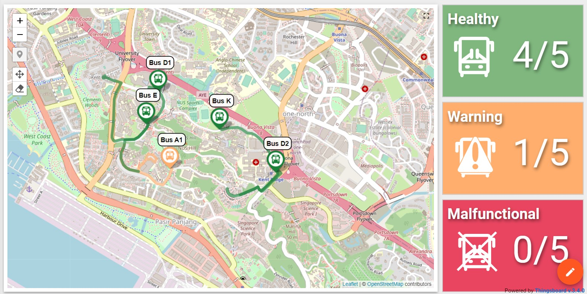
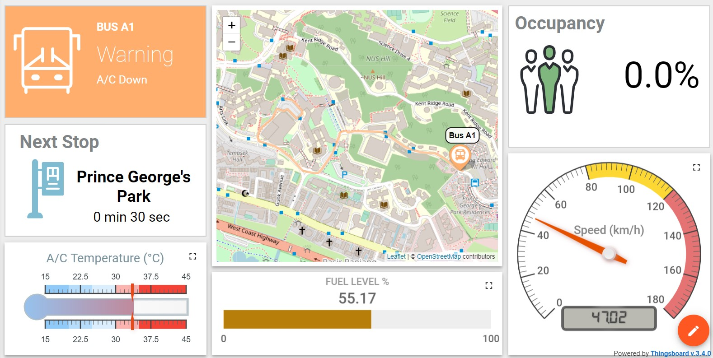
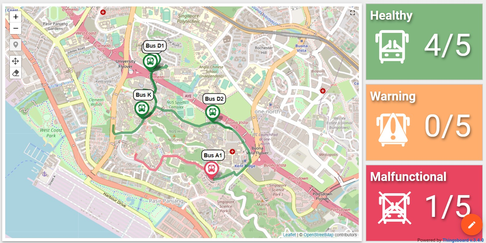
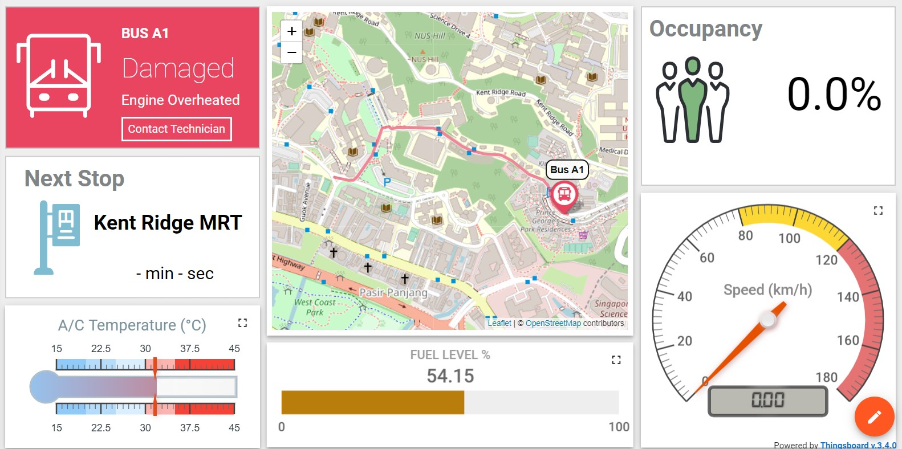

# NUS Campus Bus Tracking Dashboard


A demo dashboard for NUS campus bus tracking using Thingsboard widgets, and a python backend app. Route data are retrieved from [NUS NextBus App](https://apps.apple.com/sg/app/nus-nextbus/id542131822).

## Setting up in Thingsboard
Firstly, import the `thingsboard\campus_bus_device_profile.json` and `thingsboard\campus_bus_device_profile.json` into Thingsboard device profile and dashboard respectively.
<br />
Secondly, create 5 individual bus devices with the device profile `CampusBus` with the following names.
<br />
Thirdly, create a gateway for the campus buses using the device profile `Gateway`. Take note of the access token which will be needed later in the python application.  

## Running the app
This application can be run in a separate machine or in the same machine as Thingsboard. If it is run in a separate machine, the machine must be able to access the Thingsboard server.
<br />
Replace the host and access token in `dashboard_bus_A1.py` and `dashboard_other_buses.py` with the Thingsboard host and access token of the gateway created earlier.
<br />
Run the following commands in the terminal to start the application.
```
$ nohup python3 dashboard_bus_A1.py > log/bus_A1.log &   
$ nohup python3 dashboard_other_buses.py > log/others.log &
```
Upon running the application, the dashboard should be updated with the bus locations every second.

## Running scenarios
The dashboard can be updated with different scenarios to stimuate warning and danger alerts. For warning alerts, the available scenarios are faulty air-conditioning, and low fuel. To run each scenario, run the following command in the terminal. One scenario is sufficient to trigger the warning alert.
```
$ cd scenarios/
$ python3 ac_faulty.py
$ python3 deplete_fuel.py
```

The dashboard will be updated with the warning alerts.



To clear the warning alerts, remedy each respective scearnio by running the following command in the terminal.
```
$ python3 ac_repair.py
$ python3 refuel.py 
```

For danger alerts, the available scenarios is highe engine temperature. To stimulate the scenario, run the following command in the terminal.
```
$ python3 hot_engine.py
```


Clear the danger alert by running the following command in the terminal.
```
$ python3 engine_repair.py
```

Alarms will also be updated at the bottom of the main dasboard. Users can clear and acknowledge the alarms by clicking on the respective buttons.

## Stopping the app
To stop the application, kill the respective python processes using their process ids from the following commands.
```
ps ax | grep py
kill <process_id>
```
